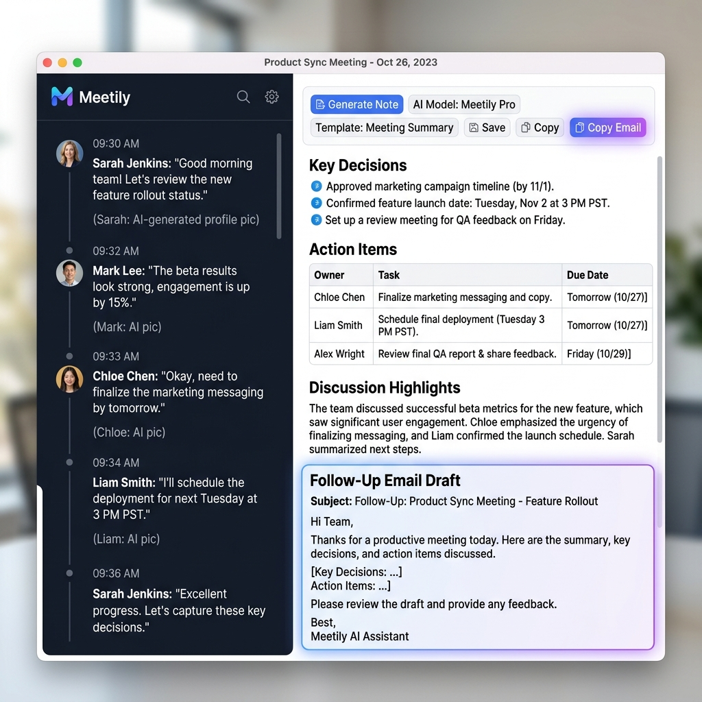
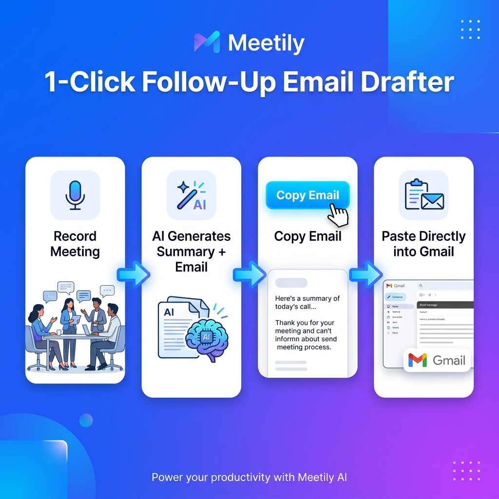

<div align="center">

<h1>🎙️ Meetily</h1>
<p><strong>Your AI-Powered Meeting Assistant — Record, Transcribe, Summarize & Follow-Up in 1 Click</strong></p>

[](https://github.com/your-repo/meetily)
[]()
[]()
[]()
[]()

<br/>



</div>

---

## 📖 What is Meetily?

**Meetily** is a privacy-first, offline-capable AI meeting assistant that runs entirely on your desktop. It automatically records your meetings, transcribes them in real-time using Whisper, and uses a local or cloud AI model to generate structured meeting notes — including a one-click **Follow-Up Email Draft** ready to paste directly into your inbox.

No cloud uploads. No subscription required for local mode. Your meeting data stays on your machine.

---

## ✨ Features

### 🎙️ Live Transcription
- Real-time speech-to-text powered by **Whisper.cpp**
- Timestamped transcript segments shown as you speak
- Speaker diarization support (identifies multiple speakers)
- Works completely offline with local Whisper models

### 🤖 AI Meeting Summarizer
- Generates structured meeting notes instantly after recording
- Supports multiple AI providers:
  - **Ollama** (fully local/offline — e.g., `gemma3:1b`, `llama3`, `mistral`)
  - **OpenAI** (GPT-4o, GPT-4 Turbo)
  - **Google Gemini** (Gemini Pro)
- Customizable summary templates (General, Engineering, Sales, etc.)
- Add custom context/prompt before generating

### 📋 Structured Summary Output
Each generated note includes:
| Section | Description |
|---|---|
| **Summary** | A concise paragraph overview of the meeting |
| **Key Decisions** | Bullet list of all decisions made |
| **Action Items** | Formatted table with Owner, Task, Due Date, and Timestamps |
| **Discussion Highlights** | Key talking points and discussion context |
| **Follow-Up Email Draft** | A ready-to-send professional email ⭐ **NEW** |

### 📧 1-Click Follow-Up Email Drafter ⭐ NEW

> **The most requested feature — now built right in!**

After your meeting summary is generated, Meetily automatically drafts a professional follow-up email based on the meeting content. With a single click of the **"Copy Email"** button, the email is copied to your clipboard — ready to paste directly into Gmail, Outlook, or any email client.



**How it works:**
1. 🎙️ **Record** your meeting as usual
2. ✨ Click **"Generate Note"** — the AI writes the summary AND the email
3. 📧 Click **"Copy Email"** at the top of the screen
4. 📋 **Paste** into Gmail or Outlook — done in seconds!

**Example output:**

```
Subject: Follow-Up: Q3 Marketing Review & LinkedIn Budget Shift

Hi Team,

Following our Q3 marketing review meeting today, I wanted to summarize
our key decisions and next steps.

We have agreed to shift 20% of our ad budget from Facebook to LinkedIn
starting next month to better support our B2B lead performance goals.

Action Items:
- Sarah: Finalize LinkedIn ad creatives by Wednesday
- Mark: Pull Facebook performance report by Friday afternoon
- Full team check-in: Monday

Please feel free to reach out if you have any questions.

Best regards,
[Your Name]
```

### 📁 Meeting History & Search
- All past meetings saved locally in a database
- Sidebar with searchable meeting list
- Click any past meeting to view its transcript and summary

### 💾 Save & Edit Notes
- All AI-generated notes are fully editable
- Changes auto-save or manually save with the **"Save"** button
- Export summary as Markdown

### 🎨 Multiple Summary Templates
Choose the right template for your meeting type:
- **General Meeting** — Works for any meeting
- **Engineering Standup** — Sprint progress, blockers, technical decisions
- **Sales Call** — Customer pain points, objections, follow-up actions
- **Product Review** — Feature decisions, roadmap, design feedback
- *(More templates can be added by the community)*

---

## 🖥️ Demo

### How the 1-Click Email Feature Works

> 📹 **Video Demo:** *(Coming soon — record your first meeting and see it in action!)*

**Quick Test Script** — Read this aloud after clicking "Start Recording":

> *"Alright everyone, let's wrap up our Q3 marketing review. We've officially decided to shift 20% of our ad budget from Facebook over to LinkedIn starting next month, since our B2B leads are performing much better there. Sarah, I need you to finalize the new LinkedIn ad creatives by next Wednesday. Mark, please pull the final performance report by Friday afternoon. Let's touch base again on Monday. Great work, team."*

After clicking **"Generate Note"**, the AI will produce:
- ✅ A clean structured summary
- ✅ An Action Items table with Sarah and Mark's tasks
- ✅ A professional follow-up email — ready to copy and send!

---

## 🚀 Getting Started

### Prerequisites

| Tool | Version | Purpose |
|---|---|---|
| [Node.js](https://nodejs.org/) | v18+ | Frontend build |
| [pnpm](https://pnpm.io/) | Latest | Package manager |
| [Rust](https://rustup.rs/) | Stable | Tauri desktop runtime |
| [Python](https://python.org/) | 3.10+ | AI backend |
| [Ollama](https://ollama.com/) | Latest | Local AI models (optional) |

---

### ⚡ Quick Start (Windows)

**Step 1: Clone the repository**
```bash
git clone https://github.com/your-repo/meetily.git
cd meetily
```

**Step 2: Start everything with one command**
```bash
start_project.bat
```
This script automatically starts the Whisper server, the Python AI backend, and the Tauri desktop app.

---

### 🔧 Manual Setup

#### 1. Start the Whisper Transcription Server
```bash
cd backend/whisper-server-package
./whisper-server.exe --model models/ggml-tiny.en.bin --host 127.0.0.1 --port 8178 --diarize --language en
```

> 💡 **Tip:** Use `ggml-small.en.bin` or `ggml-medium.en.bin` for better transcription accuracy.

#### 2. Start the Python AI Backend
```bash
cd backend
python -m venv venv
venv\Scripts\activate        # Windows
# source venv/bin/activate   # macOS/Linux
pip install -r requirements.txt
python app/main.py
```

#### 3. Start the Desktop App
```bash
cd frontend
pnpm install
npx tauri dev
```

The Meetily desktop window will open automatically.

---

### 🤖 Setting Up Your AI Model

#### Option A: Local (Offline) — Ollama
```bash
# Install Ollama from https://ollama.com
ollama pull gemma3:1b        # Lightweight, fast (recommended for testing)
ollama pull llama3           # Better quality summaries
ollama pull mistral          # Excellent for meeting notes
```
In Meetily, click **AI Model → Provider: Ollama** and select your model.

#### Option B: Cloud — OpenAI
1. Click **AI Model** in the app
2. Select **Provider: OpenAI**
3. Enter your OpenAI API key
4. Select model: `gpt-4o` or `gpt-4-turbo`

#### Option C: Cloud — Google Gemini
1. Click **AI Model** in the app
2. Select **Provider: Gemini**
3. Enter your Google AI API key

---

## 📁 Project Structure

```
meetily/
├── backend/                          # Python FastAPI AI backend
│   ├── app/
│   │   ├── main.py                   # FastAPI server entry point
│   │   └── transcript_processor.py  # AI summarization & email drafting
│   └── whisper-server-package/       # Pre-built Whisper.cpp binary
│       └── models/                   # Whisper model files (.bin)
│
├── frontend/                         # Tauri + Next.js desktop app
│   ├── src/
│   │   ├── app/                      # Next.js pages
│   │   ├── components/               # React UI components
│   │   │   ├── AISummary/            # Summary rendering (react-markdown)
│   │   │   └── MeetingDetails/       # Meeting detail panels & buttons
│   │   └── hooks/                    # Business logic hooks
│   └── src-tauri/                    # Rust Tauri backend
│       └── src/
│           ├── audio/                # Audio capture & recording
│           └── api/                  # Native API commands
│
├── docs/
│   └── images/                       # README assets
│
├── start_project.bat                 # One-click launcher (Windows)
└── README.md                         # This file
```

---

## 🛠️ Tech Stack

| Layer | Technology |
|---|---|
| **Desktop Runtime** | [Tauri](https://tauri.app/) (Rust) |
| **Frontend** | [Next.js 14](https://nextjs.org/) + React + TypeScript |
| **Styling** | Tailwind CSS + shadcn/ui |
| **Transcription** | [Whisper.cpp](https://github.com/ggerganov/whisper.cpp) |
| **AI Backend** | Python FastAPI |
| **AI Models** | Ollama / OpenAI / Google Gemini |
| **Database** | SQLite (local, via Tauri) |
| **Markdown Rendering** | react-markdown + remark-gfm |

---

## 🔒 Privacy

Meetily is designed with **privacy first**:
- ✅ All recordings processed **locally on your machine**
- ✅ Transcriptions done via **local Whisper** — no audio ever leaves your device
- ✅ When using **Ollama**, AI summarization is also 100% local/offline
- ⚠️ When using OpenAI/Gemini, transcript text is sent to their APIs (subject to their privacy policies)

---

## 🗺️ Roadmap

- [x] Live real-time transcription
- [x] AI meeting summarization (Ollama, OpenAI, Gemini)
- [x] Structured notes (Key Decisions, Action Items, Discussion Highlights)
- [x] **1-Click Follow-Up Email Drafter** ⭐
- [x] Meeting history & search
- [x] Multiple AI templates
- [x] Editable notes with save
- [ ] Calendar integration (Google Calendar / Outlook)
- [ ] Automatic speaker name detection
- [ ] Export to Notion / Confluence
- [ ] Meeting recording playback
- [ ] Slack/Teams notification after meeting

---

## 🤝 Contributing

Contributions are welcome! Here's how to get started:

```bash
# Fork the repo and clone your fork
git clone https://github.com/YOUR-USERNAME/meetily.git

# Create a feature branch
git checkout -b feature/your-feature-name

# Make your changes and commit
git commit -m "feat: add your feature"

# Push and open a Pull Request
git push origin feature/your-feature-name
```

Please follow conventional commits (`feat:`, `fix:`, `docs:`, `chore:`).

---

## 📄 License

This project is licensed under the **MIT License** — see the [LICENSE](LICENSE) file for details.

---

## 🙏 Acknowledgements

- [Whisper.cpp](https://github.com/ggerganov/whisper.cpp) — blazing fast local speech recognition
- [Ollama](https://ollama.com/) — running large language models locally
- [Tauri](https://tauri.app/) — lightweight, secure desktop apps with Rust + web tech
- [BlockNote](https://www.blocknotejs.org/) — rich text editor for meeting notes
- [shadcn/ui](https://ui.shadcn.com/) — beautiful, accessible UI components

---

<div align="center">
  <p>Made with ❤️ for people who hate writing meeting notes</p>
  <p><strong>⭐ Star this repo if Meetily saves you time!</strong></p>
</div>
